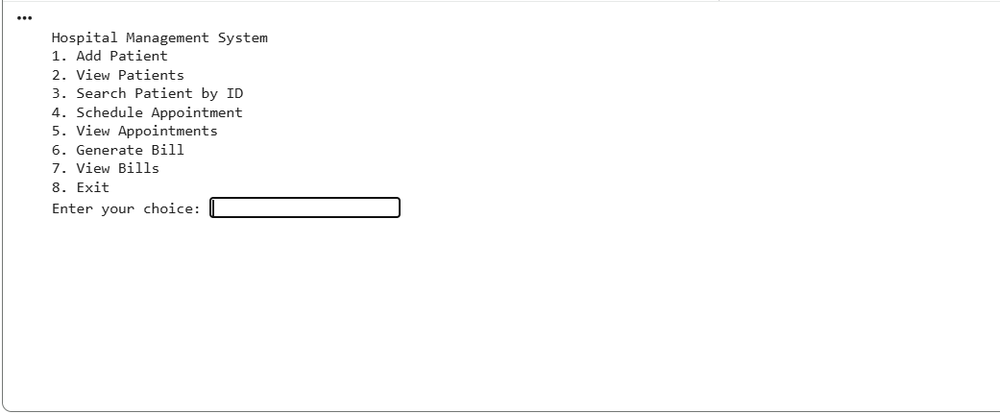

# Hospital Management System

A console-based Hospital Management System developed in **Java** using **Object-Oriented Programming (OOP)** concepts. The application provides a simple command-line interface for managing patients, appointments, and billing records.

---

## Application Preview

---

## Project Overview

The Hospital Management System (HMS) is a Java-based console application designed to demonstrate the implementation of basic hospital management operations using Object-Oriented Programming.

The system provides separate modules for:

- Patient management
- Appointment scheduling
- Billing management

Each record is assigned a unique identifier using Java's `UUID` functionality, while application data is maintained in memory using Java collections.

---

## Key Features

### Patient Management

- Add new patients
- Automatically generate unique Patient IDs
- View all registered patients
- Search patients using Patient ID
- Store patient name, age, and ailment information

### Appointment Management

- Schedule appointments for patients
- Automatically generate unique Appointment IDs
- Automatically calculate the next available appointment slot
- Record doctor name, appointment date, and time
- View scheduled appointments

### Billing Management

- Generate bills for patients
- Automatically generate unique Bill IDs
- Record multiple services
- Store total billing amount
- View generated bills

---
## Technologies Used

   Technology	                          Purpose
1.Java	                        Core application development
2.OOP	                        Modular system design
3.Java Collections Framework	In-memory data management
4.UUID	                        Unique record identification
5.Java Date & Time API	        Appointment slot calculation
6.Java Scanner	                Command-line user input
7.CLI	                        User interaction

## System Workflow

                    ┌─────────────────────┐
                    │        START        │
                    └──────────┬──────────┘
                               │
                               ▼
                ┌───────────────────────────┐
                │ Hospital Management System │
                └─────────────┬─────────────┘
                              │
                              ▼
                    ┌──────────────────┐
                    │   Display Menu   │
                    └────────┬─────────┘
                             │
           ┌─────────────────┼─────────────────┐
           │                 │                 │
           ▼                 ▼                 ▼
   ┌───────────────┐ ┌───────────────┐ ┌───────────────┐
   │    Patient    │ │  Appointment  │ │    Billing    │
   │   Management  │ │   Management   │ │   Management  │
   └───────┬───────┘ └───────┬───────┘ └───────┬───────┘
           │                 │                 │
           ▼                 ▼                 ▼
   ┌───────────────┐ ┌───────────────┐ ┌───────────────┐
   │ Add / View /  │ │ Schedule /    │ │ Generate /    │
   │ Search Patient│ │ View          │ │ View Bills    │
   └───────┬───────┘ └───────┬───────┘ └───────┬───────┘
           │                 │                 │
           └─────────────────┼─────────────────┘
                             │
                             ▼
                    ┌──────────────────┐
                    │    Return to     │
                    │      Menu       │
                    └────────┬─────────┘
                             │
                             ▼
                       ┌────────────┐
                       │    Exit?   │
                       └─────┬──────┘
                             │
                    ┌────────┴────────┐
                    │                 │
                   No                Yes
                    │                 │
                    └───────┐         ▼
                            │    ┌──────────┐
                            └───►│   END    │
                                 └──────────┘

---

## Project Structure
Hospital-Management-System/
│
├── README.md
├── LICENSE
├── .gitignore
│
├── src/
│   └── HospitalManagementSystem.java
│
└── docs/
    ├── Hospital-Management-System-Presentation.pptx
    ├── Hospital-Management-System-Project-Report.pdf
    ├── README.md
    │
    └── screenshots/
        └── hms-console.png

##  Application Menu

Hospital Management System

1. Add Patient
2. View Patients
3. Search Patient by ID
4. Schedule Appointment
5. View Appointments
6. Generate Bill
7. View Bills
8. Exit

## Data Management

The current implementation uses Java ArrayList collections for storing:

Patient records
Appointment records
Billing records

##  Object-Oriented Design

The application is structured around four main classes:

HospitalManagementSystem
        │
        ├── Patient
        │
        ├── Appointment
        │
        └── Bill
    ---

Main Classes

Patient

Stores patient information such as:

Patient ID
Name
Age
Ailment

Appointment

Stores appointment information such as:

Appointment ID
Patient ID
Doctor name
Date
Time

Bill

Stores billing information such as:

Bill ID
Patient ID
Services
Total amount

HospitalManagementSystem

Acts as the main management class and handles:

Patient operations
Appointment operations
Billing operations
Application menu and user interaction

## Current Limitations

The current version is intentionally designed as a console-based academic project.

-No database integration
-No permanent data storage
-No authentication or authorization
-No graphical user interface
-Basic input validation
-No patient update/delete functionality
-Appointment and billing operations do not currently validate patient existence

##  Future Enhancements

The project can be extended with:

MySQL or PostgreSQL database integration
User authentication and role-based access
GUI or web-based interface
Patient record update and deletion
Advanced appointment management
Payment processing
Medical inventory management
Reports and analytics
Data backup and recovery
REST API integration
AI-assisted hospital analytics

## Learning Outcomes

This project demonstrates practical understanding of:

Java programming
Object-Oriented Programming
Classes and objects
Constructors
Lists and collections
UUID-based identification
Date and time handling
Console-based application development
Basic modular software design

##  Author

Vikram R.

Academic Java Project
Hospital Management System
